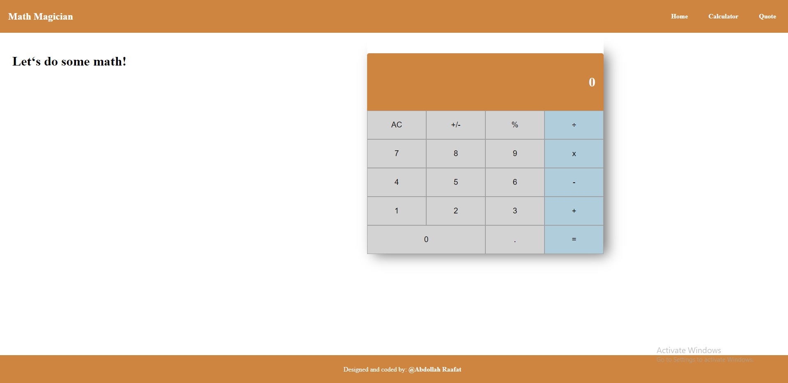

# Math Magicians

"Math magicians" is a website for all fans of mathematics. It is a Single Page App (SPA) that allows users to:
- Make simple calculations.
- Read a random math-related quote.

## Built With

- Html & CSS
- JS
- React

## Screenshot

## Get a copy

- Prepare a local directory. 
- Open terminal.
- Clone this project by the command `https://github.com/AbdollahRaafat/math-magicians.git`.
- Run `npm install`.
- Run `npm start`.

## Author

- GitHub: [AbdollahRaafat](https://github.com/AbdollahRaafat)
- LinkedIn: [AbdollahRaafat](https://www.linkedin.com/in/abdollah-raafat-886059221/)
- Twitter: [AbdollahRaafat](https://twitter.com/abdollah_raafat)

## Acknowledgments

- Microverse

## 📝 License

This project is [MIT](./LICENSE) licensed.